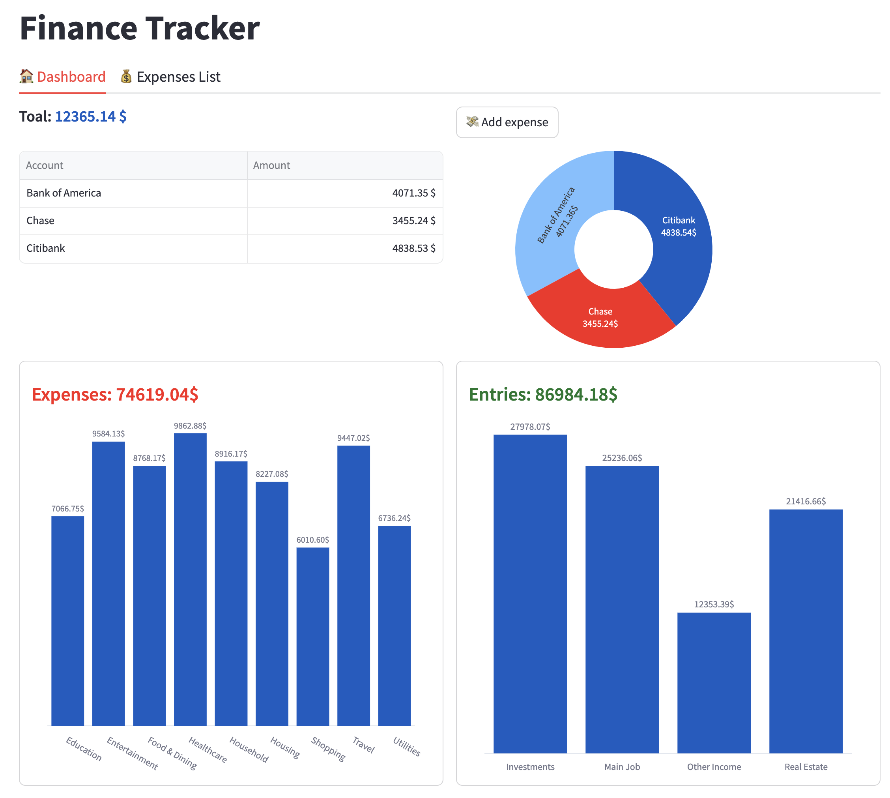
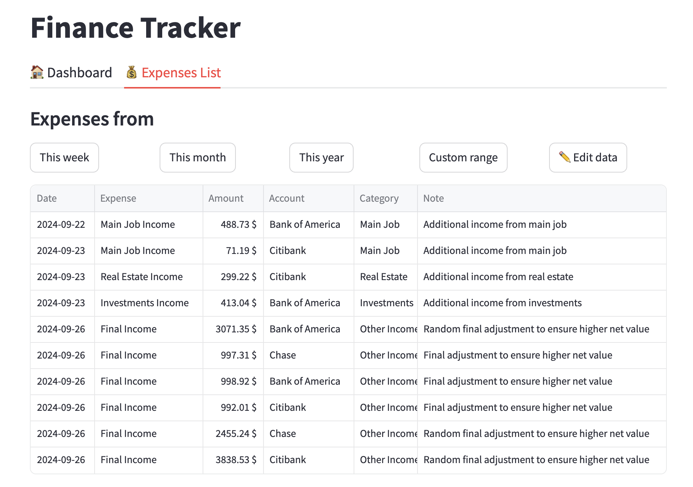
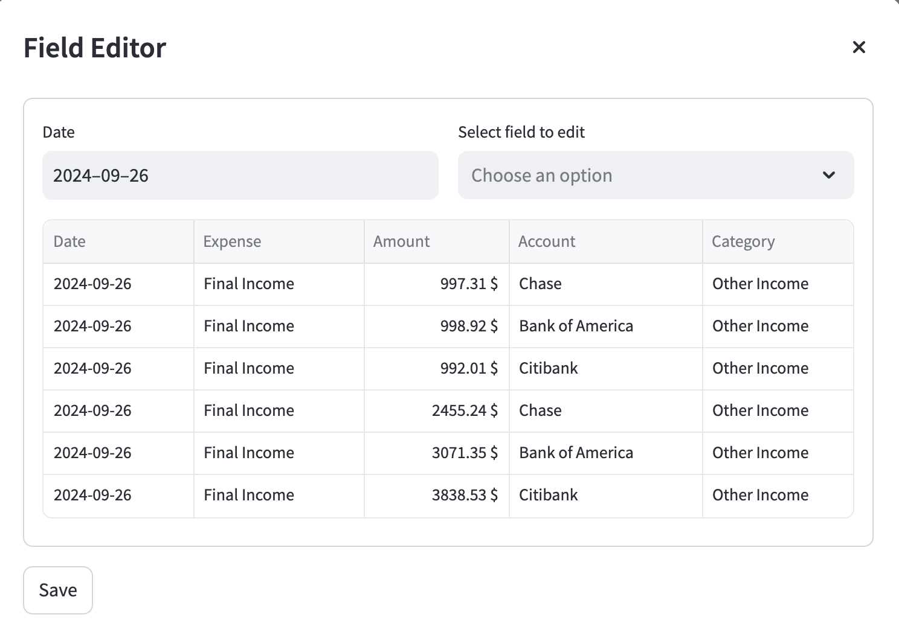
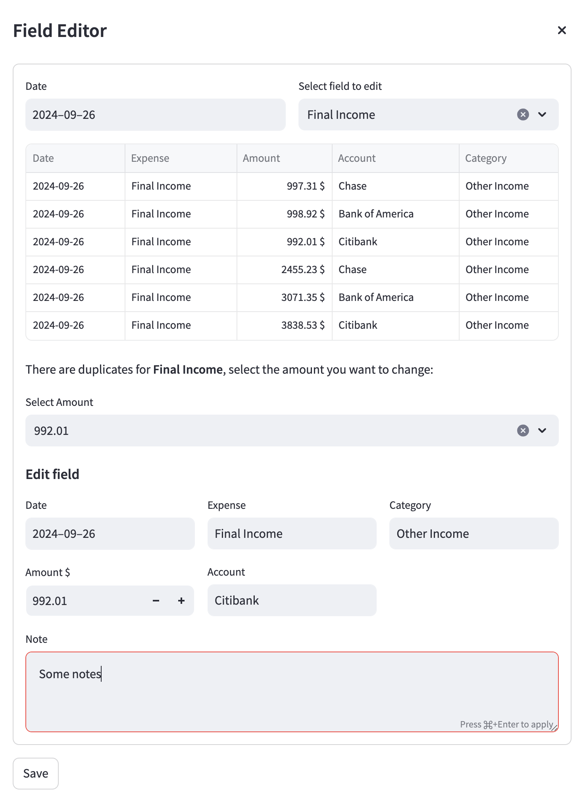

# Streamlit Finance Tracker
A finance tracker web-app built with Streamlit. 
- Try the application with simulated data here:
- Interact and make suggestion here:

## Overview

This is the main dashboard where you can see at a first glance how much you earned or spent so far, also you can see your current balance across various bank accounts.

### Adding new data

Inserting a new expense is done by pressing "Add epxense", a pop-up like this will open:

### Display or edit existing data

By heading to the expenses tab you can see all the data that has been logged so far, by default you see only ten of the most recent entries, but you can easily show more or less using the buttons. 

#### Editing data

You can edit existing entries by using the "Edit data" button:

It can happen that there are duplicated voices, for this reason before you can modify anything you first have to properly find the right entry to modify. In this case there are many "Final Income" voices:

The app warns you that there are duplicates and forces you to choose the amount you want, then the "edit field" sections appears and here you can do your changes.

## Planned features
- Multiple users (possibly using [stramlit authenticator](https://github.com/mkhorasani/Streamlit-Authenticator))
- Access your data trough WebDav (or other solutions)
- Import or export all data as a csv. You can still use your own data by running the app locally. 

Other suggestions are welcome.

---
Thank's for checking out this project!